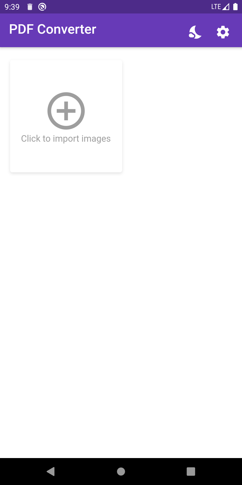
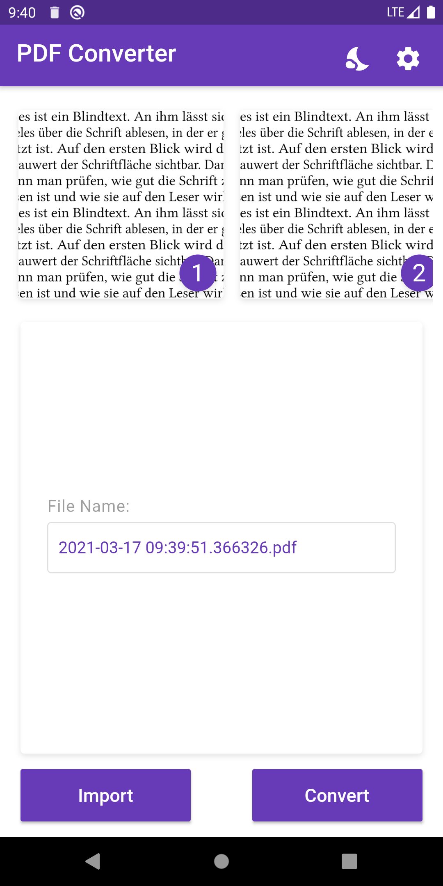

# Img-To-PDF-Converter
A flutter full fledged Image to PDF converter for educational use in flutter.
 
### Languages & tools :
[][website]
[][dart]
[][flutter]
  

| Home Page | Convert Page |
|------|-------|
|||
### Directory Structure :
    |-- tinder_app
    |    |-- android
    |    |
    |    |-- ios
    |    |
    |    |-- web
    |    |
    |    |-- test
    |    |   |-- widget_test.dart
    |    |
    |    |-- lib
    |    |   |-- Widgets
    |    |   |   |-- app_bar.dart
    |    |   |   
    |    |   |-- Constants
    |    |   |   |-- widget_container.dart
    |    |   |
    |    |   |-- screen.dart
    |    |   |-- export.dart
    |    |   |-- main.dart
    |    |
    |    |-- pubspec.lock
    |    |-- pubspec.yaml
    |    |-- README.md
    |
    |-- Img
    |    |-- androidstudio.png
    |    |-- dart.png
    |    |-- flutter.png
    |    |-- PdfConverter1.png
    |    |-- PdfConverter2.png

### Connect with me :  

  
 

[website]: https://abhilashtuofficial.github.io/
[dart]: https://github.com/AbhilashTUofficial/CloneApps
[flutter]: https://github.com/AbhilashTUofficial/CloneApps
